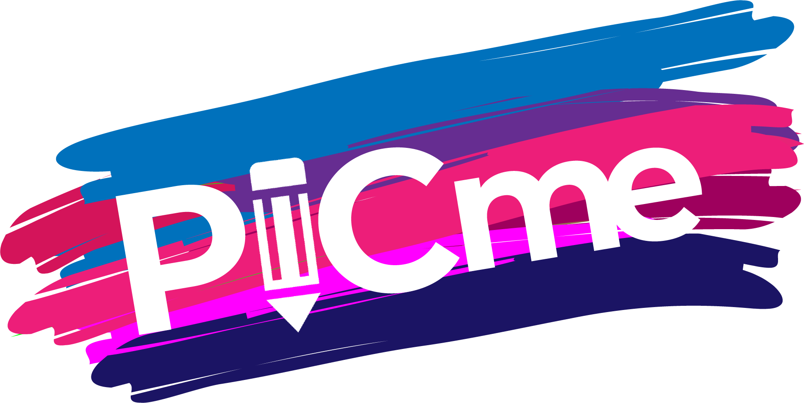

# PicMe – Draw with Friends, Anywhere!

## Play Here: https://picme.seilcho7.dev/




## Updates / Reflections from over a year later

I believe that I have grown much as developer in the past year or so. Part of the reason why is because I believe that a developer has to be driven by growth in one way or the other. Having now gained experience as a developer working in a corporation with an Agile environment, one thing that I've learned (that doesn't have much to do with coding itself ironically) is that I have never submitted/ closed a Jira ticket without this feeling that "I could have done better". This does NOT mean that I have done/ turned in subpar work, our coding review process definitely protects against that. What this DOES mean however is that at any given time, a developer can look back at a couple lines of code and say "Huh, maybe I should have done this" or "Gee, why did I do that!". Some developers anguish at the thought of having to look at code they've shelved away, but for some others, its part of the learning process or at the very least a *reflective* process. So its time for some reflection! 
```
 constructor(props) {
    super(props);
    this.state = {
      drawingData: '',
      drawing: '',
      drawEnd: false,
      name: '',
      gamePin: '',
      roomId: '',
      saveRoomId: '',
      socketRoomId: '',
      users: '',
      redirect: false,
      joined: styles.joinButton,
      isHost: false,
      answerChoices: ['bird', 'birdDog', 'Flying Panda!'],
      start: false,
      pointsArray: '',
      showHost: true,
      kickUsers: false,
      endGame: false,
      resetGame: false
    };  
  }
```
Wow look at all those states! It would be a shame if a state management library came along and..... I don't know....make your life 1000 times easier? And no, this doesn't mean install Redux and begin converting *every* single possible interaction to a Redux action. The great thing(and terrible thing tbh) about React is that updates will happen and new techniques will come along to make your life a living.....joy! The introduction of React Hooks quite honestly changed the game for me.
I was terrified at having to learn a "new way to write React components", but honestly it was a breath of fresh air. Class based components are just NOT it for me and React hooks come with a bunch of sweet tools, with the most relevant one here being *React.useReducer*. useReducer provides a more 'in house' solution to state management at the component level. Does this completely replace Redux with its global store of states? Nope. In fact the more complicated an app is the more I would advocate for Redux over a simple useReducer hook. Here however, it works because of the relatively "small" amount of state management going on. So....why didn't our team of up and coming Developers use any state management?

 Time. We essentially were given two weeks to start and finish a full-stack application that we would be forever proud of and to show off to employers that we were capable and...well the list goes on. Two weeks is enough to get something up and going, not a finished product but a demo to be honest. We needed a FINISHED product, one that worked well and we could let people use without having to worry about things going wrong. The development process had to be expedited, so initially we laid the groundwork for what we would *absolutely* need at the bare minimum, and what tools we would end up using or not using. I'll be honest, I was one of the people that advocated AGAINST a redux store the most. This was a mistake and everyone knew it a week later. Our team should have recognized that something as "Event-driven" as a multiplayer GAME would require many many many states to drive the App and make it interactive and functional and FUN. 
 
 Do I regret not using state management at the time? Nope. In our bootcamp, we had literally just been introduced to the concept of Redux, and everyone in my group was still scratching their heads at that concept still. We had a lot on our plate at the time and I personally didn't want to further complicate the lives of everyone at the time. We were stressed 24/7 during the final project and the day we finished was a day that I still remember quite vividly. 

```
wss.on('connection', function connection(socket) {
    console.log('new connection');
    socket.send(JSON.stringify({
        roomPin,
        showHostButton,
        showJoinButton
    }))
    // on new connection if db .length is greater than one needs to send a stringified version of db[db.length-1]
    socket.on('message', async (data) => {   
        const {drawData, name, gamePin, roomId, start, saveRoomId, answer, selectedAnswer, timerOn, showHost, kickUsers, showJoin, changeClass, toggleAnswers, endGame, resetGame, resetUserAnswer} = JSON.parse(data);
        let {nextPlayer} =JSON.parse(data)
```
Web sockets. Oh web sockets. Looking at this code sample I can't help but thinking how much of a genius I felt like at the time. Everyone has their 400 IQ moments while Developing, and this was one of my 400 IQ moments. During the first couple of days of the project, we challenged each other to get something *working*. Anything working. We were all nervous and scared that our grand vision of a multiplayer game would fail. As an avid gamer and someone who loves taking on new challenges, I couldn't let the vision disappear. I had to find out a way to somehow get an individual client to transfer their drawing data over a server to another client. Simple enough right? It sounds like something that should be easily doable (and to be honest now I feel like this would be a cinch and something I wouldn't stress over). But wait.....did you say a drawing? As in mouse events that result in a canvas being populated with individual pixels and lines and strokes and colors? Yeah....that sounds....doable? Look! I was able to send over data! It worked.....wait why did it disappear? No! Come back please! The premise of a websocket is simple enough. Websockets are a protocol that allow for low latency communication between the client and the server. I knew that many multiplayer games utilized websockets for that simple reason and so I thought okay, lets go ahead and use it. The thing is, at time, everything was magic to me. Things just "worked" sometimes with very little effort (and a lot of video tutorials), so when things didn't function properly I kinda blamed the tool I was using. It was short-sighted of me, but again without self-critique then we'll never learn right? After going through about 3 different Canvas components, I had finally settled on one that was easy to understand and had plenty of documentation to go along with it. But.....my drawings were still disappearing? Its those darn websockets....I just know it. My data is being sent and logged and received by the server and being sent to another client! But....once it reaches the client its not loading properly. Websockets must be the wrong tool for the operation. No, they weren't. My state management just wasn't quite up to the standard that it should have been. 

```
this.connection.onmessage = (e) => {
      console.log(e);
      console.log(e.data);
      this.setState({
        drawing: JSON.parse(e.data)
      });  
      console.log (this.state.drawing)    
    }
  }
```

Very early on, this is how I handled new data being received over the websocket connection. In my mind, it would work perfectly and well, it did work at a very basic level. However if you went back to my previous code sample, you'll notice that there is a LOT of data being transmitted over the websocket connection (though not all the data came through at each moment of the game). In order to make a cohesive experience, I had to add more variables, more functions, more states, more clear front end components that showed change. The App would never be as simple as one person draws, one other receives, and others respond. Every game has rules, and if those rules aren't laid out clearly then people won't play the game the way it was meant to be in the developers head. Your vision has to match expecations! You have to have a clear flow of data that is representative of every function that you write out, every variable, every state. Every tool that you use has to have a clear purpose and you have to adapt the tool to best suit your needs. That is true for small scale, and large scale projects. 

## What is it? 
PicMe is an interactive, multiplayer game which involves challenging players to draw weird, funny and sometimes ridiculous prompts on their personal devices. The drawings are shown live on a host screen, as the player is drawing. Other users are able to view the drawing from the host screen and submit a guess as to what the user is drawing. After 25 seconds, the user that was drawing is shown all the submitted answers. He/she is required to select one that they like best (similar to Cards Against Humanity), which then gives that user a point. This is considered the end of one round of gameplay; the next round then starts with another person drawing a new image.

## How did we make it?
* Frontend:
    * React.js
    * Websockets
    * CSS3
    * HTML5 
    * React-Sketch
    * React-Confetti
    * React-Countdown-Clock
    * React-Router-Dom
    * Styled-Component
* Backend:
    * PostgreSQL
    * Express.js
    * Node.js

## What were our headaches?
A major challenge was having the ability for the drawing to be accurate on personal devices (especially on iOS devices). For example, the lines were off by a millimeter based on the user’s touch as well as the Sketchfield component would move around while the user drew. This issue was detrimental in having a flawless user experience, thus we converted our drawing field from react-canvas-draw to react-sketch. However, this created another problem that we needed to solve – the drawings that appeared “live” on the host page were now delayed. With a few tweaks, we were able to have the user drawing appear live on the host page so everyone can view and guess in real time.
## Login screen

## PicMe demo 

